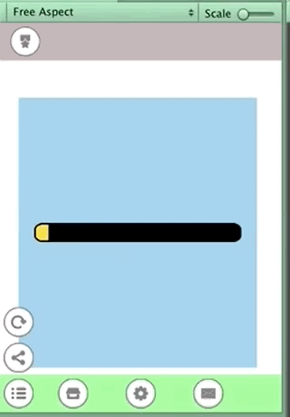

## demo03

Gauge bar move by tween of scale.x. Gauge bar anchor is stretch mode and Pivot is (0,0.5). so , if scale.x is 0, width is 0. scale.x is 1, width is gauge body width. If you control the width of the gauge bar directly by the program, you need to know the maximum gauge width, but this method is simple as it just moves the scale from 0 to 1.
