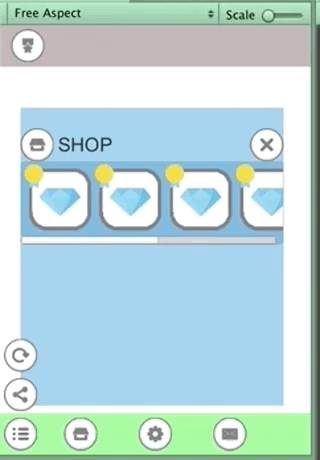
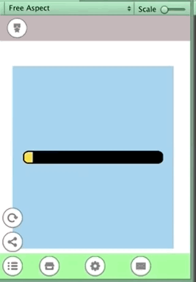

## Study_uGUI
study uGUI

## Usage
1. Git clone and open unity project
2. Import asset from AssetStore
[Flat Icoon & UI - 2D Puzzle Game UI](https://assetstore.unity.com/packages/2d/gui/icons/flat-icoon-ui-2d-puzzle-game-ui-69370)

## Demo

demo which divided UI into parts of header, contents, footer and set pivot & anchor respectively. Therefore, even if the screen size changes, the rough position is not changed
***

Scrollbar demo
***

Gauge bar move by tween of scale.x. Gauge bar anchor is stretch mode and Pivot is (0,0.5). so , if scale.x is 0, width is 0. scale.x is 1, width is gauge body width.
If you control the width of the gauge bar directly by the program, you need to know the maximum gauge width, but this method is simple as it just moves the scale from 0 to 1.
