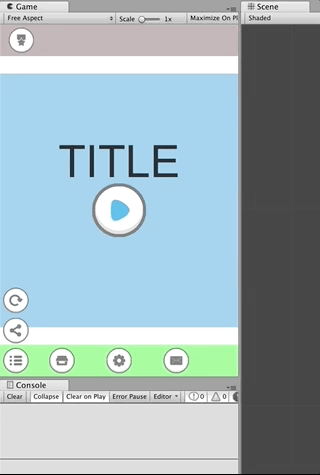

## Study_uGUI
study uGUI

## Usage
1. Git clone and open unity project
2. Import asset from AssetStore
[Flat Icoon & UI - 2D Puzzle Game UI](https://assetstore.unity.com/packages/2d/gui/icons/flat-icoon-ui-2d-puzzle-game-ui-69370)
3. Import asset from AssetStore [DoTween](https://assetstore.unity.com/packages/tools/animation/dotween-hotween-v2-27676)

## Demo
|demo|description|
|:--:|:--|
||demo01. Auto scale demo|
||demo02. Scrollbar demo|
||demo03. Gauge demo|
||demo04. Text Adjust demo|
||demo05. Text Adjust demo(with min/max size)|

## Library , Assets
* [Flat Icoon & UI - 2D Puzzle Game UI](https://assetstore.unity.com/packages/2d/gui/icons/flat-icoon-ui-2d-puzzle-game-ui-69370)
* [DoTween](https://assetstore.unity.com/packages/tools/animation/dotween-hotween-v2-27676)
* [FUKIDASHI DESIGN](http://fukidesign.com/)

## License Logo

